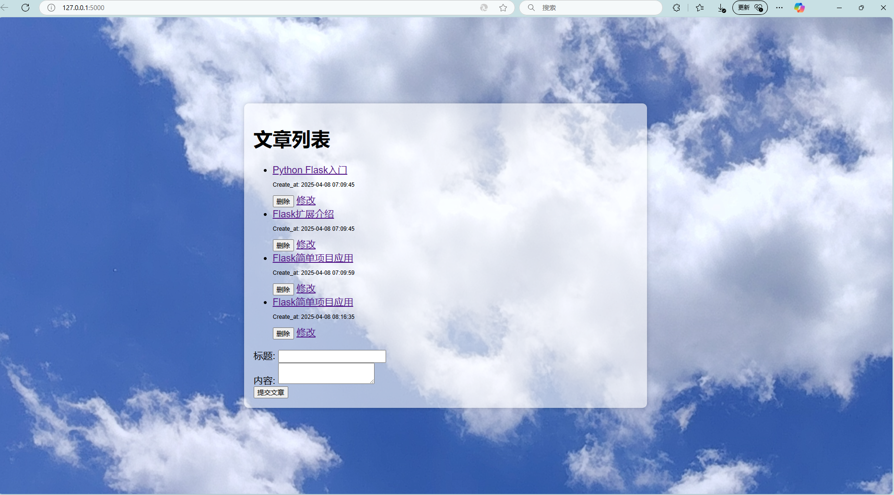

# 基于Flask的文章管理系统
## 一、项目介绍

本项目是一个基于Flask框架开发的简单文章管理系统，实现了文章的增、删、改、查功能，为用户提供了便捷的文章管理操作界面。

## 二、功能特性

### 1. 文章展示

   · 列表展示：在首页（/articles 路由对应的视图函数 index），从数据库中获取所有文章信息，通过 render_template 渲染 index.html 模板展示文章列表。列表中每个文章包含标题和创建时间，标题以超链接形式呈现，点击可跳转到对应文章详情页。
   
   · 详情展示：/articles/<int:article_id> 路由对应的 article 视图函数，根据传入的文章 id 从数据库中查询文章详情，再渲染 article.html 模板展示文章的标题、创建时间和内容，并提供返回文章列表、删除和修改文章的操作链接或按钮。
   
### 2. 文章添加

   · 路由/submit对应的 submit 视图函数处理文章添加功能。当用户在前端页面填写文章标题和内容并提交表单（method="post"）时，该函数从表单中获取数据，创建新的文章对象并添加到数据库，然后重定向到文章列表页面。

### 3. 文章删除

   · 路由/delete/<int:article_id> 对应的 delete 视图函数接收文章 id，从数据库中获取对应的文章对象并删除，之后重定向回文章列表页面，实现删除指定文章的功能。

### 4. 文章修改

   · 编辑页面展示：/edit/<int:article_id> 路由对应的 edit 视图函数在接收到 GET 请求时，根据文章 id 从数据库获取文章信息，渲染 edit.html 模板，展示包含文章当前标题和内容的编辑页面。
   
   ·修改提交处理：当 edit 视图函数接收到 POST 请求时，从表单中获取修改后的标题和内容，更新数据库中对应文章的信息，成功后重定向到修改后的文章详情页面。若更新过程出现异常，会打印错误信息并回滚数据库事务 。

## 三、技术栈
### 1. 后端
   · Flask: Python轻量级Web框架，用于构建应用的后端逻辑和路由
   
   · Flask-SQLAlchemy: Flask的扩展，用于简化与SQL数据库（本项目使用SQLite）的交互操作
   
   · Flask-Migrate: 实现数据库迁移，方便管理数据库模式的变更
   
   · Python: 项目的主要编程语言，用于编写业务逻辑和处理数据库操作
### 2. 前端
   · HTML：构建页面的结构
   
   · CSS：通过styles.css文件对页面样式进行定制，如调整文章标题和按钮的字体大小等。

## 四、运行

首先pip install -r requirements.txt

### 准备好项目文件
   应包含以下文件：
   - your_project_folder/
      - app.py              # Flask应用主程序，包含路由和数据库操作逻辑
      - templates/          # 存放HTML模板文件
         - index.html       # 文章列表页面模板
         - article.html     # 文章详情页面模板
         - edit.html        # 文章编辑页面模板
   - static/             # 存放静态文件
      - styles.css       # 样式文件
      - background.jpg   # 背景图片
### 运行项目

在项目根目录下的终端中，执行 python app.py 命令启动 Flask 应用。默认情况下，应用将在 http://127.0.0.1:5000 地址上运行。如果在 app.py 中设置了自定义的 host 和 port，则按照设置的地址和端口启动。

### 访问应用

打开浏览器，在地址栏中输入应用的访问地址，例如：http://127.0.0.1:5000/articles

即可访问文章管理系统，进行相关操作。

### 关闭应用 
在运行应用的终端中，按下 Ctrl + C 组合键停止应用的运行

### 最后的页面结果如下：

   
